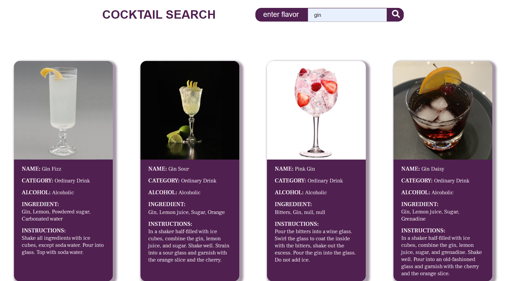

## Table of contents

- [Overview](#overview)
  - [The challenge](#the-challenge)
  - [Screenshot](#screenshot)
  - [Links](#links)
- [My process](#my-process)
  - [Built with](#built-with)
  - [What I learned](#what-i-learned)
- [Author](#author)

## Overview

### The challenge
Users should be able to: search with a flavor and get a picture of desired 

### Screenshot

### Links
- Solution URL: [https://github.com/activus-d/cocktail-picker](https://github.com/activus-d/cocktail-picker)
- Live Site URL: [https://activus-d.github.io/cocktail-picker/](https://activus-d.github.io/cocktail-picker/)

## My process

### Built with
- Semantic HTML5 markup
- CSS custom properties
- Flexbox
- Vanilla JavaScript

### What I learned
Able to pracice more with fetching data from API

## Author

- Blog - [D.M. Oladele](https://activuscode.hashnode.dev/)
- Twitter - [@activus_d](https://twitter.com/activus_d)

